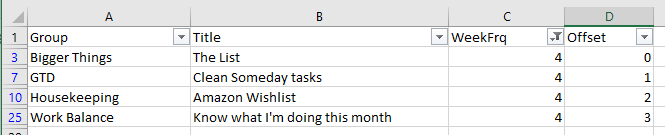

# Weekly Review

A simple Python tool to help stay on top of mindfulness.

## Installing

Provided you've got Python 3 installed, merely download this repo and run

```
pip install requirements.txt
```

which will ensure you've got all of the dependencies installed.

## Usage

Once everything in installed, usage is as simple as

```
python weekly_review.py
```

or if you're as lazy as I am, double-clicking `run_review.sh`

This will yield a command prompt that marches through your Weekly Review text (progressing as you hit the Enter key)


## `config/`

The basic idea of this tool is that you've got items that you want to think about with some arbitrary frequency. These items can be categorized into arbitrarily-many different groups and that you sit down to take inventory about once a week.

There are three main points of configuration to the tool:

### `happy.txt`

I've found that re-articulating and reflecting on what makes me happy has had a strongly-positive impact on helping me sharpen my goal focus and stay in touch with what motivates me.

Edit this file as you see fit-- I'd encourage you to add/remove things as they start to become more/less important to you.

### `intro.txt` and `reminder.txt`

I use these files to help me get into the context of the Weekly Review that I'm about to do. Easy to remove from `utils.print_boilerplate()` if it's superflous to your needs.

### `weekly_review.csv`

This is where the majority of your edits will happen.

The only columns you need to concern yourself with are `Group`, `Title`, and `WeekFrq`. The first two are self-explanatory and the third is the integer value that completes the phrase "I want to see this item every **X** weeks."

#### Offset

The final column, `Offset`, is generated at the top of each call to `weekly_review.py` and essentially spaces out Items with the same `WeekFrq` so you're not hit with an avalanche of Items one week and much fewer the following.

For example:

I have four items that I want to see at an every-four-week pace. By leveraging the `Offset` column, I see them the first, second, third, and fourth weeks of the month instead of all at the top.



#### On Ordering

Don't sweat keeping the Groups/Items in sort-order, that will automatically get resolved whenever you run the tool.
